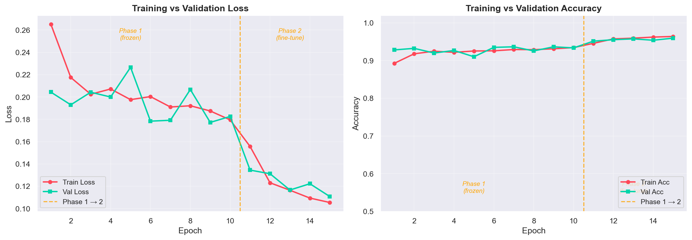
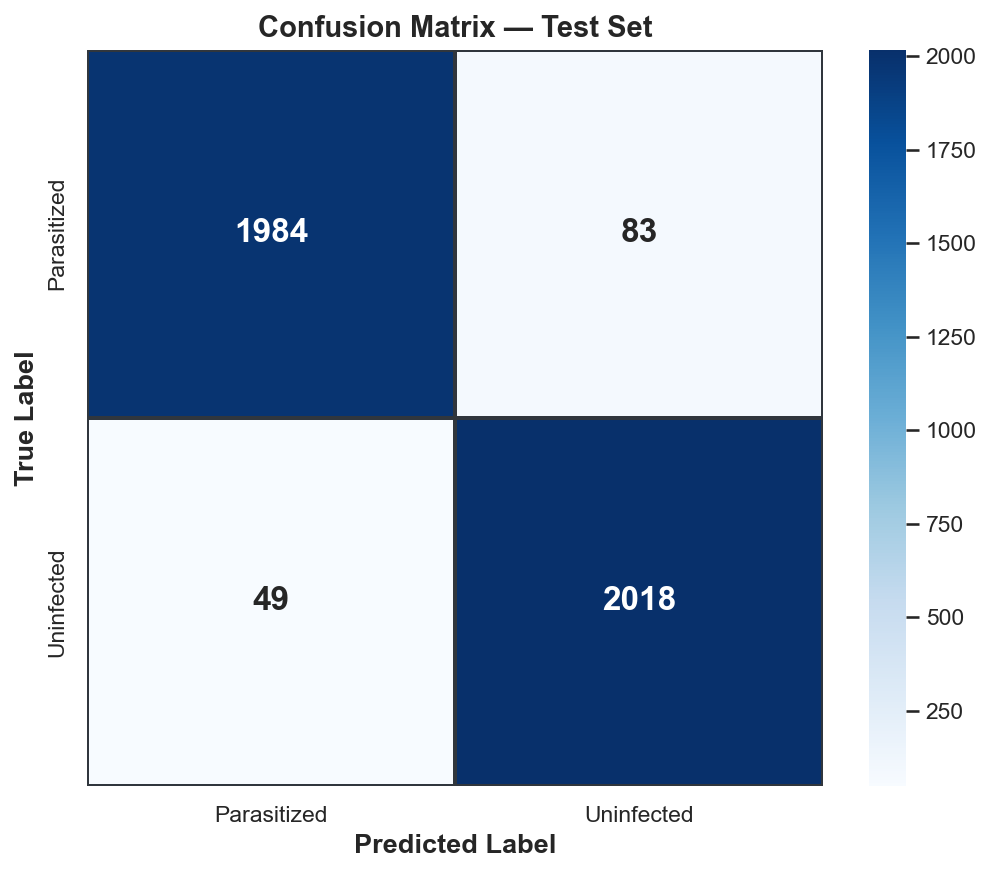
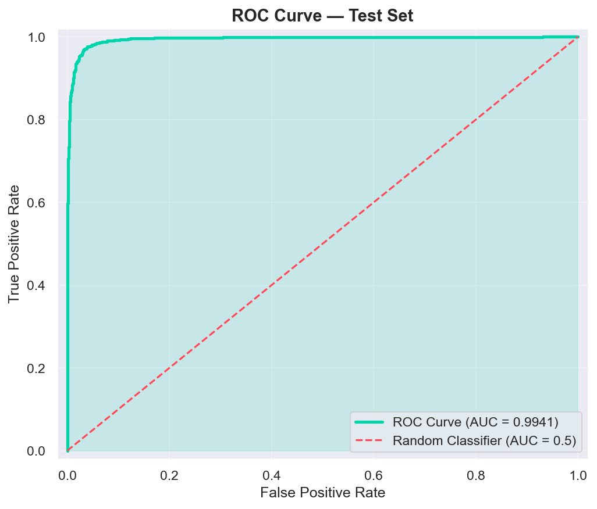
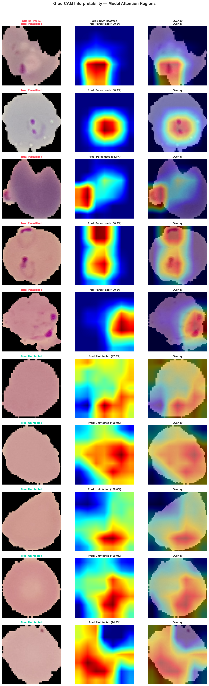

# MalariaNet — AI-Powered Malaria Detection from Red Blood Cell Images

MalariaNet is an end-to-end deep learning project that classifies red blood cell microscopy images as **Parasitized** (infected with *Plasmodium* malaria parasites) or **Uninfected** (healthy). The system uses a fine-tuned **MobileNetV2** convolutional neural network trained on the Kaggle "Cell Images for Detecting Malaria" dataset (27,558 images, 2 classes). Transfer learning from ImageNet enables the model to achieve high accuracy with limited medical imaging data.

The project includes a complete Jupyter notebook covering EDA, preprocessing, two-phase training (frozen backbone + fine-tuning), evaluation with confusion matrix and ROC curve, Grad-CAM interpretability, and dynamic quantization benchmarking. A production-ready **FastAPI** web application serves the model with a dark-themed clinical frontend, allowing users to upload cell images and receive instant predictions with Grad-CAM visual explanations highlighting which regions of the cell influenced the diagnosis.

---

## Architecture

```
┌─────────────────────────────────────────────────────────────────────┐
│                        MalariaNet Pipeline                         │
├─────────────────────────────────────────────────────────────────────┤
│                                                                     │
│  ┌──────────┐    ┌──────────────┐    ┌──────────────┐              │
│  │  Kaggle   │───>│ Preprocessing │───>│    Data      │              │
│  │  Dataset  │    │ Resize 224x224│    │ Augmentation │              │
│  │ 27,558 img│    │ + Normalize   │    │ Flip/Rot/Jit │              │
│  └──────────┘    └──────────────┘    └──────┬───────┘              │
│                                              │                      │
│                                              v                      │
│  ┌──────────────────────────────────────────────────┐              │
│  │              MobileNetV2 (Transfer Learning)      │              │
│  │  ┌────────────────────┐  ┌─────────────────────┐ │              │
│  │  │  Frozen Backbone   │  │  Custom Classifier   │ │              │
│  │  │  (ImageNet weights)│─>│  1280->256->ReLU->   │ │              │
│  │  │  features[0..15]   │  │  Dropout(0.4)->2     │ │              │
│  │  └────────────────────┘  └─────────────────────┘ │              │
│  └──────────────────────────────────┬───────────────┘              │
│                                      │                              │
│                    ┌─────────────────┼─────────────────┐           │
│                    v                 v                  v           │
│             ┌───────────┐    ┌────────────┐    ┌────────────┐      │
│             │ Prediction │    │  Grad-CAM  │    │ Confidence │      │
│             │ Para/Uninf │    │  Heatmap   │    │   Score    │      │
│             └───────────┘    └────────────┘    └────────────┘      │
│                    │                 │                  │           │
│                    v                 v                  v           │
│  ┌──────────────────────────────────────────────────────────┐      │
│  │            FastAPI Backend (app.py)                        │      │
│  │  GET /        -> Serve frontend (index.html)              │      │
│  │  POST /predict -> JSON { label, confidence, gradcam }     │      │
│  └──────────────────────────────┬───────────────────────────┘      │
│                                  │                                  │
│                                  v                                  │
│  ┌──────────────────────────────────────────────────────────┐      │
│  │         Frontend (templates/index.html)                    │      │
│  │  Dark clinical theme | Drag-drop upload | Results panel   │      │
│  └──────────────────────────────────────────────────────────┘      │
│                                                                     │
└─────────────────────────────────────────────────────────────────────┘
```

---

## Dataset

| Property | Value |
|----------|-------|
| **Source** | [Kaggle — Cell Images for Detecting Malaria](https://www.kaggle.com/datasets/iarunava/cell-images-for-detecting-malaria) |
| **Total Images** | 27,558 |
| **Classes** | 2 (Parasitized, Uninfected) |
| **Balance** | ~50/50 (balanced) |
| **Image Sizes** | Variable (~40x40 to ~400x400 px) |
| **Split** | 70% train / 15% val / 15% test (stratified) |

---

## Expected Results

| Metric | Expected Value |
|--------|---------------|
| **Accuracy** | ~95%+ |
| **AUC (ROC)** | ~0.97+ |
| **Precision (weighted)** | ~0.95+ |
| **Recall (weighted)** | ~0.95+ |
| **F1 Score (weighted)** | ~0.95+ |

---

## Results Gallery

### Training Curves



### Confusion Matrix



### ROC Curve



### Grad-CAM Interpretability



---

## Local Setup (using uv)

### 1. Initialise the project

```bash
# Clone or navigate to the project directory
cd "Malaria detection from red blood cell images using CNN"

# Initialise uv project (if pyproject.toml doesn't exist yet)
uv init
```

### 2. Install dependencies

```bash
uv add torch torchvision fastapi "uvicorn[standard]" python-multipart \
    grad-cam scikit-learn pillow numpy matplotlib seaborn jupyter \
    opencv-python-headless
```

### 3. Download the dataset

Download from [Kaggle](https://www.kaggle.com/datasets/iarunava/cell-images-for-detecting-malaria) and extract so the structure is:

```
cell_images/
├── Parasitized/
│   ├── C1_thinF_IMG_20150604_104722_cell_1.png
│   ├── ...
│   └── (13,779 images)
└── Uninfected/
    ├── C1_thinF_IMG_20150604_104722_cell_2.png
    ├── ...
    └── (13,779 images)
```

### 4. Train the model (Jupyter notebook)

```bash
uv run jupyter notebook malaria_model.ipynb
```

Run all cells in order. Training produces `best_model.pth` in the project root.
Generated figures are saved to `docs/assets/` for documentation and GitHub display.

### 5. Run the web application

```bash
uv run uvicorn app:app --host 0.0.0.0 --port 8000
```

Open `http://localhost:8000` in your browser.

---

## How to Use the Web App

1. Open the app in your browser (`http://localhost:8000`)
2. Drag and drop a red blood cell microscopy image onto the upload zone (or click to browse)
3. Click **"Analyse Cell"**
4. View the results:
   - **Diagnosis badge** — INFECTED (red) or HEALTHY (green)
   - **Confidence bar** — model certainty as a percentage
   - **Grad-CAM overlay** — heatmap showing which cell regions influenced the decision
   - **Explanation text** — human-readable summary of the prediction

---

## Deployment to Render.com

### Step 1 — Push to GitHub

```bash
git init
git add .
git commit -m "Initial commit: MalariaNet malaria detection project"
git remote add origin https://github.com/YOUR_USERNAME/malarianet.git
git push -u origin main
```

### Step 2 — Handle `best_model.pth`

The trained model file (`best_model.pth`) is ~9 MB for MobileNetV2, which is under GitHub's 100 MB limit. If your model exceeds 100 MB:
- Use [Git LFS](https://git-lfs.github.com/): `git lfs track "*.pth"` before committing
- Or upload manually via Render's persistent disk feature

### Step 3 — Connect to Render

1. Go to [render.com](https://render.com) and sign in
2. Click **"New +"** → **"Web Service"**
3. Connect your GitHub repository
4. Render auto-detects `render.yaml` and configures:
   - **Build command:** `pip install -r requirements.txt`
   - **Start command:** `uvicorn app:app --host 0.0.0.0 --port 8000`
5. Set Python version to 3.11 (under Environment)

### Step 4 — Deploy

1. Click **"Create Web Service"**
2. Wait for the build to complete (~5-10 minutes for PyTorch install)
3. Your app is live at `https://malarianet-XXXX.onrender.com`

### Step 5 — Share

Share the live URL with your teacher/professor.

---

## Tech Stack

| Component | Technology |
|-----------|-----------|
| **Deep Learning Framework** | PyTorch |
| **CNN Architecture** | MobileNetV2 (transfer learning from ImageNet) |
| **Interpretability** | Grad-CAM (pytorch-grad-cam) |
| **Backend** | FastAPI + Uvicorn |
| **Frontend** | HTML5 / CSS3 / Vanilla JavaScript |
| **Data Science** | scikit-learn, matplotlib, seaborn, NumPy, Pillow |
| **Package Manager** | uv |
| **Deployment** | Render.com |
| **Notebook** | Jupyter |

---

## Rubric Alignment

| Rubric Criteria | Project Section | Evidence |
|----------------|----------------|----------|
| **Domain understanding** | Section 1 — Domain Introduction | 3 paragraphs on malaria, RBC microscopy, and AI rationale |
| **Data exploration** | Section 2 — EDA | Class distribution, sample images, pixel histograms, size analysis |
| **Preprocessing & feature engineering** | Section 3 | PyTorch transforms with medical-imaging rationale, stratified splits |
| **Model selection & justification** | Section 4 | MobileNetV2 rationale, transfer learning explanation, architecture diagram |
| **Training methodology** | Section 5 | Two-phase training, learning rate scheduling, loss/accuracy curves |
| **Evaluation & metrics** | Section 6 | Accuracy, Precision, Recall, F1, confusion matrix, ROC-AUC |
| **Interpretability / explainability** | Section 7 — Grad-CAM | 10 Grad-CAM visualisations with clinical interpretation |
| **Optimisation** | Section 8 — Quantization | Dynamic quantization with honest performance comparison |
| **Deployment / productionisation** | app.py + index.html | FastAPI backend, responsive frontend, Render deployment |
| **Code quality** | All files | Comments explaining WHY, not just what; modular design |
| **Documentation** | README.md | Setup instructions, architecture diagram, rubric mapping |

---

## Project File Structure

```
Malaria detection from red blood cell images using CNN/
├── malaria_model.ipynb       # Complete Jupyter notebook (Sections 1-8)
├── app.py                    # FastAPI backend with Grad-CAM endpoint
├── templates/
│   └── index.html            # Dark-themed clinical frontend
├── cell_images/              # Dataset (user downloads from Kaggle)
│   ├── Parasitized/          #   ~13,779 infected cell images
│   └── Uninfected/           #   ~13,779 healthy cell images
├── best_model.pth            # Trained model weights (generated by notebook)
├── docs/
│   └── assets/               # Saved training/evaluation/Grad-CAM figures for README
│       ├── training_curves.png
│       ├── confusion_matrix.png
│       ├── roc_curve.png
│       └── gradcam_results.png
├── pyproject.toml            # uv project configuration
├── requirements.txt          # Pip dependencies (CPU-only torch for Render)
├── render.yaml               # Render.com deployment config
└── README.md                 # This file
```

---

## License

This project is for educational purposes only. It is **not** a medical device and should not be used for clinical diagnosis.
